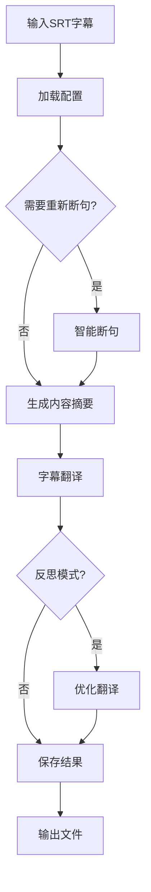

# Captioner_Translate 项目架构说明

## 1. 项目概述

Captioner_Translate 是一个基于OpenAI API的智能字幕翻译和优化工具。

主要功能：
- 将英文字幕翻译成中文
- 智能分段和优化处理
- 支持SRT和ASS格式字幕

## 2. 核心模块结构

### 2.1 主程序入口 (subtitle_translator_cli.py)
- 处理命令行参数
- 协调整体工作流程
- 初始化翻译环境
- 管理输入输出文件

### 2.2 字幕处理模块 (subtitle_processor/)

#### 配置管理 (config.py)
- API设置
  - OpenAI API密钥和基础URL
  - LLM模型选择
- 翻译参数配置
  - 目标语言设置
  - 字幕长度限制
- 性能参数
  - 线程数
  - 批处理大小

#### 字幕优化和翻译核心 (optimizer.py)
- 多线程批量处理
- 支持普通翻译和反思模式
- 智能错误检测
- 翻译结果优化
- 日志收集和分析

#### 提示词模板 (prompts.py)
- 分段提示词：智能断句指导
- 总结提示词：内容分析和提取
- 翻译提示词：普通翻译模式
- 反思提示词：优化翻译模式

#### 其他功能模块
- summarizer.py：内容总结和分析
- spliter.py：智能字幕分段
- aligner.py：字幕时间轴对齐

## 3. 工作流程

## 4. 关键功能特性

### 4.1 智能断句
- 基于语义理解进行合理分段
- 保护专业术语和产品名称
- 维护句子语义完整性
- 优化显示效果

### 4.2 反思模式
- 对翻译结果进行二次优化
- 提供修改建议和原因
- 改进专业术语翻译
- 提升表达自然度

### 4.3 多线程处理
- 并行处理提高效率
- 智能任务分配
- 避免API限流
- 批量处理优化

### 4.4 术语管理
- 维护专业术语一致性
- 保护特定名词不被翻译
- 统一技术词汇翻译
- 支持自定义术语表

### 4.5 错误检测
- 智能识别潜在问题
- 分析格式和内容变化
- 检测不当替换
- 提供详细错误报告

## 5. 输出文件

项目处理完成后会生成以下文件：
- `example_en.srt`：优化后的英文字幕（句子已合并优化）
- `example_zh.srt`：翻译后的中文字幕
- `example.ass`：双语字幕文件（同时显示中英文）

## 6. 设计特点

### 6.1 模块化架构
- 组件职责明确
- 高内聚低耦合
- 易于扩展和维护
- 支持功能复用

### 6.2 性能优化
- 多线程并行处理
- 批量任务处理
- 智能资源分配
- 缓存机制

### 6.3 错误处理
- 完善的异常处理
- 详细的日志记录
- 智能错误恢复
- 用户友好提示

### 6.4 可扩展性
- 支持新模型接入
- 可自定义处理流程
- 灵活的配置系统
- 插件化设计
